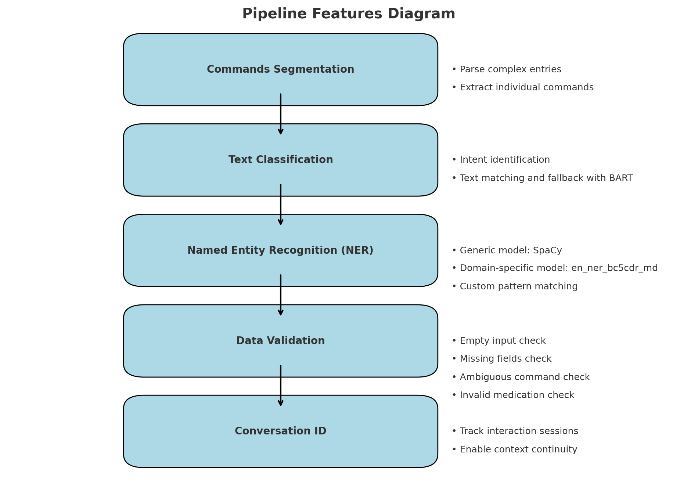

# Intelligent Task Management Bot
This repository offers an AI-driven solution for developing a prototype NLP-based assistant designed to:

1. Parse natural language commands related to nursing tasks.
2. Identify the intent behind the commands and extract relevant entities.
3. Generate structured output representing the extracted tasks.

## Features:
- Intent Recognition.
- Entity Extraction.
- Commands Segmentation.
- REST API using FastAPI.

## Solution




The solution is divided into 5 main components:

1. Commands Segmentation:

    This feature is designed to parse complex or multi-request entries. It leverages SpaCy's (en_core_web_sm) model, which is generally trained on internet text, to extract individual commands from a combined entry. This allows each command to be processed independently.

2. Text Classification:

    This feature is responsible for identifying the intent behind natural language commands. It employs a text-matching approach to classify intents. 
    I also utilized a fallback mechanism for more robustness,a META AI Zero-Shot Learning text classification model (BART) is incorporated to handle cases where text matching alone may not be sufficient.

3. Named Entity Recognition (NER):

    This feature focuses on identifying and extracting relevant entities from commands. To address the diverse range of entities—ranging from generic entities (e.g., name, gender, age) to highly specific ones (e.g., medicine names, dosages)—we employed the following approach:

    Generic Entities Model:

        Utilized SpaCy's (en_core_web_sm) model to identify common entities such as name, gender, and age.

    Domain-Specific Model: 

        Leveraged SpaCy's (en_ner_bc5cdr_md) model to focus on specific entities like medicine names and dosages.

    Pattern Matching: 

        Incorporated a custom pattern-matching technique to enhance robustness, particularly for recognizing entities such as dates and dosage frequencies. This approach ensured greater accuracy and reliability in extracting these types of information.

4. Data Validation:

    This feature ensures the accuracy and completeness of input data through a four-stage process:

    * Empty Input Check:

        Response: "Input text cannot be empty."

    * Missing Fields Check:

        Verifies that all required fields for the specified intent are provided.

        Response: "Please provide: <the missing field> as it is important to complete the task."

    * Ambiguous Command Check:

        Detects and flags commands that lack clear intent.

        Response: "Ambiguous intent. Please clarify your command."

    * Invalid Medication Check:

        Validates the provided medication names against a predefined Database.

        Response: "Invalid medication: <medicine name>. Please provide a valid medication."

5. Conversation ID:

    this component ensures continuity in multi-turn conversations by uniquely identifying and tracking each interaction session. This allows the system to maintain context across multiple exchanges, enabling seamless handling of follow-up queries and tasks within the same conversation.


## Setup:
1. Clone the repository:
 > git clone https://github.com/username/task_management_bot.git 

 > cd Intelligent_TM
2. Create a virtual environment and install dependencies:
> python -m venv venv source venv/bin/activate 

> pip install -r requirements.txt
3. download models: 
> medical pretrained : 
pip install https://s3-us-west-2.amazonaws.com/ai2-s2-scispacy/releases/v0.5.0/en_core_sci_md-0.5.0.tar.gz

> generally pretrained: 
python -m spacy download en_core_web_sm
4. Run the API:

> uvicorn main:app --reload

## Test:
 - i've created testcases for the basic components of the project like :
    * Intent Detection test.
    * Entity Extraction test.
    * Data validation test.
    * Edge cases test.

Run tests using:

> python -m unittest discover

## API Usage:
**POST** `/parse-task/` 

Example 1, a single request input:

```json
{
    "text": "Assign medication Paracetamol 500mg twice a day for Leonel Messi."
}
```


Example 1 output:

```json
{
  "Request number 1": {
    "status": "success",
    "intent": "assign medication",
    "entities": {
      "name": "Leonel Messi",
      "medication": "Paracetamol",
      "dosage": "500 mg",
      "frequency": "twice a day"
    }
  }
}
```


Example 2, a multi request input:

```json
{
    "text": "Assign medication Paracetamol 500mg twice a day for Leonel Messi and schedule a follow up for his brother Leonardo Dicaprio on monday 24th of january 9 pm"
}
```


Example 2 output:

```json
{
  "Request number 1": {
    "status": "success",
    "intent": "assign medication",
    "entities": {
      "name": "Leonel Messi",
      "medication": "Paracetamol",
      "dosage": "500 mg",
      "frequency": "twice a day"
    }
  },
  "Request number 2": {
    "status": "success",
    "intent": "schedule follow up",
    "entities": {
      "name": "Leonardo Dicaprio",
      "date": "24th of january 9 pm"
    }
  }
}
```

### notes while installing scispacy

* please follow these steps to avoid nmslib compatibility issues:
1. ```bsh pip install cmake```
2. ```bash pip install pybind11 psutil numpy```
3. ```bash git clone https://github.com/nmslib/nmslib.git```
4. ```bash cd nmslib/python_bindings```
5. ```bash python setup.py install```
6. ```bash pip install scispacy```